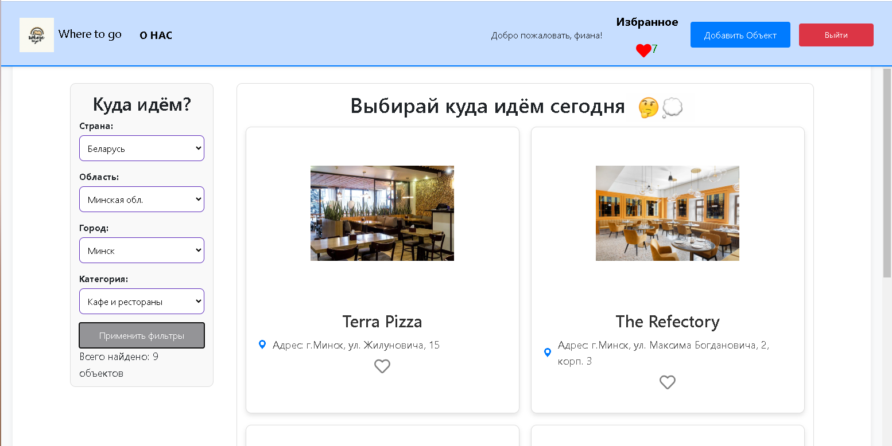

# 🚀 Where to Go – Платформа для поиска мест и событий  


## 📌 О проекте  
**Where to Go** – это веб-приложение, которое помогает пользователям находить интересные места, события и достопримечательности. Пользователи могут сохранять избранные места, редактировать профиль и легко ориентироваться по платформе.  

## 🎯 Основные функции  
✅ Поиск и просмотр мест и событий  
✅ Добавление мест в "Избранное"  
✅ Управление профилем (изменение имени и фамилии)  
✅ Удобный интерфейс и адаптивный дизайн  

## 🛠️ Технологии  
- **Frontend:** React
- **Backend:** Django / DRF
- **База данных:** PostgreSQL 
- **Авторизация:** JWT 
- **Стили:** CSS

## 📦 Установка и запуск  
1. **Склонируй репозиторий:**  
   ```bash
   git clone https://github.com/ТВОЙ_GITHUB/where-to-go.git
   cd where-to-go
📷 Скриншоты



👥 Автор
Юрий Власенко – разработчик и архитектор проекта
